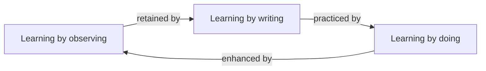
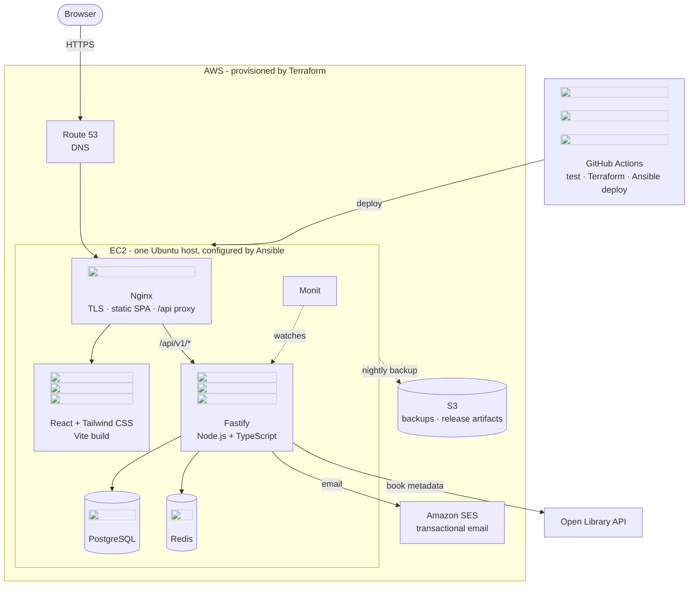

In the past, when someone had an idea, they started coding it from line one. With AI coding agents, you can start at the end by building the entire project first. Bootstrap a project that interests you, then use it as your own personal sandbox. Learn by tweaking and tinkering, not wasting hours getting stuck.

<!--more-->

In this article, I'll take you through an example modern tech stack project, of the kind you might want to learn from across the frontend, backend, database and infrastructure, using the [Full Stack Developer](https://roadmap.sh/full-stack) roadmap as a model. However, the principles apply to any stack and any project you can think of.

For my project, I decided on a simple idea called [bestbooks.guide](https://bestbooks.guide/) ([GitHub](https://github.com/georgestephenson/best-books-guide)). It's a simple interactive website, with basic user features, like tracking which books you've read. It was easy to get up and running quickly, it's something I'm interested in, and it can be extended in any number of ways.



See [Appendix A: Architecture Diagram](#appendix-a-architecture-diagram) for a detailed look at the bestbooks.guide tech stack.

## Learning patterns

With the rate of progress of tech, software development requires lifelong learning, yet the rate of improvement in AI has made this increasingly daunting. Being able to generate limitless code is a good thing and a bad thing: there have never been more opportunities for learning, and yet more opportunities for complacency.

There are three main ways of learning that I think should be _combined_ to learn anything properly:

1. **Learning by observing** - watching lectures or courses, reading textbooks, listening to podcasts. The material should be substantive and good quality, which will require deep mental focus and effort. If the material is too easy, it could be a sign that it's oversimplifying things, which can lull you into a false sense of security and teach bad habits.
    - Find high-quality, authoritative sources of information to learn from, so that you don't waste your time. You should find the material engaging and intellectually meaningful so that you will finish it. Avoid "content producers" on YouTube.
    - It's also critical that you do not remain passive while absorbing the material, so that it is retained. This is where the other learning patterns come into play.
2. **Learning by writing** - what's come to be called the Feynman technique. Writing notes is an effective way to retain information, if done in frequent small doses, and used to test your own understanding. Write what you're learning in your own words and test you remember it.
    - I like using markdown `.md` files and `git` for my note taking. This in itself is good practice for using version control effectively. The added bonus is that your notes are backed up and have an immutable version history. You can track your progress, hold yourself more accountable, but in any case your efforts will be rewarded with an artefact that you should feel proud of producing.
    - Use notes to test your memory and form habits, not just to copy verbatim. Often the reference you are learning from is a better source of information than your own notes - the benefit is in the writing rather than the utility.
3. **Learning by doing** - putting things into practice is final confirmation that you understand something. Many of us like to jump to doing things immediately, and this post is in that spirit - I would only caution that for something as cerebral as software engineering, you need to combine it with theory and reading. While we're going to start at the end, we're not _finishing_ at the end.
    - If you're following a course or reading a textbook, _do the exercises_. In addition to writing notes, I like to fold exercise solutions into my markdown repositories too.
    - Start small and avoid heavy chores. If you get excited about a website or app idea that you want to build, think about how quickly you can ship it.


{: data-caption="The learning cycle"}

## Roadmaps

One great source of learning material is [roadmap.sh](https://roadmap.sh/).

- The roadmaps are deliberately comprehensive. Each roadmap demonstrates _all_ the key points to know about a role or skill, and lets you track your progress. You can be confident you've learned everything that matters, which comes to fruition whether you're attending job interviews or designing architecture.
- While textbooks are a superb resource, they are linear, even when they are designed to be references. [roadmap.sh](https://roadmap.sh/) maps out a hierarchy of topics and learning resources, so you can see at a glance what you know and don't know, then deep dive into resources.

A good strategy for learning anything about software or computers is to pick the roadmap that fits what you want to learn, and then apply the learning strategy above while you work through it.

Each node in a roadmap comes with example free resources. The idea is to complete one or two of these free resources, or find your own, applying all three learning patterns, then move onto the next node in the roadmap. Again I'd recommend making a repository that collects your notes, exercises and projects completed while learning the roadmap. This will help you to come up with your own "definition of done" that feels more meaningful than just reading to the end.

For this article, I'm using the [Full Stack Developer](https://roadmap.sh/full-stack) roadmap. It's beginner-friendly and generalisable to many developers.

## How to use a computer

The focus of this article is on learning full stack dev by bootstrapping a project that interests you, with the power of AI coding agents. However, you are still required to use a computer. If you are new to software development, there may be some tasks I take for granted that seem impenetrable for you.

To remedy this I would recommend a dose of therapy using the [Unix philosophy](https://en.wikipedia.org/wiki/Unix_philosophy), and installing a [Unix-like](https://en.wikipedia.org/wiki/Unix-like) operating system on your desktop computer such as [Linux](https://en.wikipedia.org/wiki/Linux). Thankfully there are options for home treatment:

- MIT's [Missing Semester of Your CS Education](https://missing.csail.mit.edu/) is a **fantastic** resource on how to use a computer. Now, although it's an introductory course, it _is_ designed for the world's brightest undergraduate computer science students. Try it first and see if it sticks, but don't be dismayed if this is still over your head.
- If you don't like Missing Semester, there are roadmaps on [roadmap.sh](https://roadmap.sh/) that cover the key skills we're interested in. Again, these are comprehensive roadmaps, so you don't need to fully complete these to get started. Try some of the free resources listed under the introductions in these roadmaps, or find your own:
    - [Linux](https://roadmap.sh/linux)
    - [Shell / Bash](https://roadmap.sh/shell-bash)
    - [Git and GitHub](https://roadmap.sh/git-github)

If you want to carry on using Windows desktop, installing [Visual Studio Code](https://code.visualstudio.com/) is a good first step.

The reason I recommend Unix philosophy is that learning small, composable programs lends itself towards having a composable mind, with a skillset tailored for software engineering. Understanding the "everything is a file" approach for program interfaces makes seemingly impossible feats straightforward and understandable.

Understanding how to manipulate simple and composable programs compounds over time, because this is literally how a coding agent harness like Claude Code works. If you have watched Claude Code at work and its use of tools confounds you, it is probably because you missed the fundamentals laid out above.

## AI coding tools

At the time of writing, we're in a period where AI models are advancing very rapidly. Models that were fairly rubbish a year or two ago now have successors that are pretty good. Frontier models are astonishingly good.

I want to briefly mention the distinction between AI models, which are the mysterious enigmas where all the magic happens, and agentic coding harnesses, which are handwritten tools that babysit and coax the model into following a useful agentic workflow that persists over time. For example, Claude Opus is a model, and Claude Code is a harness.

If you're new to this, I personally recommend Claude Code at the time of writing. The CLI tool is good, so is the VS Code plugin and the Claude Desktop app. However, there are several other competitive tools, like GitHub Copilot and Cursor, and the best tool is likely to change over time. There is a good [Claude Code roadmap](https://roadmap.sh/claude-code) that will guide you through all its features. You don't need to know everything, but understanding what is meant by _context window management_ is a good start. I have completed this roadmap myself and recommend it.

In terms of models, we're at a point where paying more money for a better model will get much better results. You may be aware that coding agents can make mistakes and hallucinate. This has rapidly diminished as models have got better. If you've opted for Claude Code, I'd recommend you use it with the Opus or Fable models rather than Sonnet for this reason. A standard Pro subscription will get you a good amount of use out of Opus, but pay for what you can afford.

## Bootstrapping your full stack project

If you have any experience with software development, you probably know how much of a problem [yak shaving](https://en.wiktionary.org/wiki/yak_shaving) is. If you've got this far, you're either already an experienced developer (congrats), or I sent you down several rabbit holes.

I'm actually trying to help. My proposal is that we can start the [Full Stack Developer](https://roadmap.sh/full-stack) roadmap by first completing it, using AI coding agents. Then we can dive deeper into each of the key technologies making up this stack, which includes React, Node.js, PostgreSQL, AWS and Terraform.

If you're comfortable, ask your AI coding agent or chatbot for suitable project ideas using the full tech stack in the roadmap. Ask it for ideas that are quick to ship and have the least chores to build and maintain. Pick the idea that most excites you.

If you need smaller steps, look at the roadmap's checkpoints. Ask Claude for ideas for a simple HTML/CSS static website, that demonstrates all the key features of HTML and CSS, without requiring other technologies. A blog is simple and useful.

### Spec-Driven Development (SDD)

It's not strictly required, but to get the most out of AI I recommend following _spec-driven development_ (SDD). I like to call it _plan-first development_, because you write a plan first before you code anything.

This is emerging as one of the more widely adopted techniques in AI-assisted software development. Claude Code comes with a Plan Mode for precisely this reason, and it's intended that you use it to draft an agreed plan before you commit to a specific implementation.

I don't want you to keep the plan private between yourself and Claude though: I want you to commit the plan to your project, in a `/docs` folder, living side-by-side with the code.

There are a few reasons I recommend it for our purposes:

- You can get involved in understanding plans before you can write any code. This is part of your learning journey. You can ask questions about the plan directly, and why things are done that way.
- Remember I said I like to use markdown files to take notes? Well, AI coding agents like them too. Claude Code can read the markdown files in our repository to enhance its context and better understand our intentions. Chat sessions are short-lived, and get more expensive the longer they are. Shifting the context into the project means it can be reused as and when it's relevant to do so.

For bestbooks.guide, here was the exact prompt I used, after creating a new GitHub repository:

> I've started this repo for a website project that will be a curated and opinionated list of best books in different subjects.
>
> Users can login and track their reading progress, rate and leave reviews, that sort of thing.
>
> Could you help me by starting to write a design document or suite of documents. You can interview me and ask me questions back to start planning the key features
>
> Note: (this isn't for putting in the document, this is between you and me) this is a portfolio project and to practice the various parts of the tech stack it uses
>
> Here's what I want the tech stack to look like:
> - Repo hosted in GitHub
> - React and Tailwind CSS
> - Node.js backend
> - PostgreSQL database
> - RESTful APIs
> - JWT Auth
> - Redis
> - To be hosted in AWS: want to use Route53, SES, EC2, VPC, S3
> - Monitoring in Monit
> - GitHub Actions
> - Ansible configuration management
> - Terraform
> - Automated testing throughout with CI gates and excellent coverage
>
> I want this to be well architected and follow best practices in July 2026 (research this) but I also want it to be simple to begin so we can ship it ASAP, and built with clean architecture so it's easily extensible.

This was enough to get Claude Code to add a `/docs` folder with a list of design documents categorised by area: `01-product.md`, `02-architecture.md`, `03-data-model.md` etc. For example, here's the proposed repository layout in `02-architecture.md`:

```
best-books-guide/
├── apps/
│   ├── web/                 # React + Vite + Tailwind SPA
│   └── api/                 # Fastify + Drizzle (see layering below)
├── packages/
│   └── shared/              # API contract types, shared constants, slug helpers
├── infra/
│   ├── terraform/
│   │   ├── bootstrap/       # state bucket + GitHub OIDC role (applied once, locally)
│   │   ├── envs/prod/       # root module for production
│   │   └── modules/         # network, compute, dns, email, storage
│   └── ansible/
│       ├── inventories/prod/
│       ├── roles/           # common, hardening, nodejs, postgresql, redis, nginx, monit, app
│       └── playbooks/       # site.yml (converge host), deploy.yml (app release)
├── docs/                    # this suite + adr/
├── .github/workflows/       # ci.yml, deploy.yml, terraform.yml, codeql.yml
├── CLAUDE.md  TODO.md  README.md  LICENSE
```

You don't need to understand everything that's going on here. But you can read it and contribute whatever opinion and understanding that you do have. You can ask questions, and Claude will answer:

> What does that do?
> Why are we doing that way?
> Is this modern best practice in [current month]? Can you research it?
> Are there any better alternatives?

Once you're happy with the plan, check also that Claude is happy with it too, knowing what it knows now. Then get Claude to update the `README.md` and `CLAUDE.md`.

Once that's done, ask Claude to fully implement it. It might take some time, and there will be a few steps requiring your intervention, like signing up for AWS. But that's it. With powerful enough models, you should be able to produce a finished working system with plan-first development.

### How much time it took

Talk is cheap, so here are the real numbers, taken from the [repository history](https://github.com/georgestephenson/best-books-guide/commits/main/).

| | |
|---|---|
| First commit | Saturday 11 July, 19:05 |
| First recognisably working site | Saturday 18 July, 22:10 ([`f320c78`](https://github.com/georgestephenson/best-books-guide/commit/f320c78)) |
| Feature-complete | Sunday 19 July, 21:18 ([`50099cc`](https://github.com/georgestephenson/best-books-guide/commit/50099cc)) |
| Elapsed | 8 days |
| Days I actually touched it | 6 |
| Recorded active time | around 9 hours |

"Recorded active time" is every commit, pull request and CI event clustered with a two-hour gap threshold. What those hours bought:

<div class="table-scroll" role="region" aria-label="Lines of code by area at the feature-complete commit" tabindex="0" markdown="1">

| Area | Lines | Files |
|---|---:|---:|
| Backend - Fastify, Node.js, TypeScript | 13,902 | 145 |
| Frontend - React, Tailwind CSS, Vite | 5,932 | 59 |
| Ansible | 1,355 | 43 |
| Design documents | 1,328 | 19 |
| Terraform | 1,319 | 39 |
| Shared package | 832 | 13 |
| GitHub Actions workflows | 307 | 5 |
| **Total** | **25,594** | **345** |

</div>

Of which 4,760 lines across 35 files are tests.

Now look at where the time actually went, because it is not where the lines are. Building the web pages was really pretty straightforward. The part that required the most intervention and had the most churn was, predictably, the AWS infrastructure, in particular Ansible, running our web server on a real VM, which Claude Code has imperfect knowledge about. Those 2,674 lines of Terraform and Ansible - a tenth of the codebase - consumed something close to half the wall-clock.

I would argue that this is where [knowing how to use a computer](#how-to-use-a-computer) really comes into its own. Claude Code's interface - which is also the interface of developers - is using shell commands, on your local machine using the AWS CLI, and via SSH. Not all of this is really "coding" but it is coding-adjacent, and understanding these fundamentals is enough to induce Claude into building a feature-complete system.

### What went wrong

Over the life of the repository, 52 of 261 CI runs failed - one in five - and nine of thirty-one production deploys failed outright. Here is what actually broke.

**The deploy pipeline ate an entire evening.** On Wednesday 15 July I merged the infrastructure and then spent two hours and twenty minutes watching deploys fail, eight of them, which was the whole session. First the release job could not authenticate to AWS at all:

```
##[error]Credentials could not be loaded, please check your action inputs:
Could not load credentials from any providers
```

The GitHub OIDC trust policy had been written, but was not correctly bound to the role. Then, after moving from an SSH key to SSM Session Manager, Ansible could reach the host but could not log in:

```
fatal: [bestbooks-prod]: UNREACHABLE! => ubuntu@i-0dc5e6872fb8112d6:
Permission denied (publickey).
```

Twice. In between, Monit had been configured beautifully and was not actually running, which took [its own commit](https://github.com/georgestephenson/best-books-guide/commit/628ece1) to notice. These are all the bits that aren't code, and the bits Claude struggles with most.

**A placeholder reached production.** The M2 deploy ran the database migration against a hostname that was, literally, the word `base`:

```
Error: getaddrinfo EAI_AGAIN base
  code: 'EAI_AGAIN', syscall: 'getaddrinfo', hostname: 'base'
```

Something had templated `DATABASE_URL` badly, and nothing between the design document and the production host noticed, because every test supplied its connection string a different way. This is the archetypal AI bug: internally consistent, green in CI, blows up the instant it touches reality.

**It failed the quality gates it had written for itself.** I asked for "excellent coverage"; Claude proposed 80% globally and 90% on the API application layer, I agreed, and it went into CI. It then failed that gate repeatedly:

```
ERROR: Coverage for branches (64.72%) does not meet global threshold (80%)
ERROR: Coverage for statements (86.39%) does not meet "apps/api/src/app/**"
       threshold (90%)
```

Five consecutive runs on one branch, inching upwards. Gates are a good technique to ensure AI agents produce better quality code, but make no guarantees on how tedious and time consuming it will be to get there.

**Tests that lied.** The M4 run passed locally and fell over in CI with unique constraint violations, because the tests shared a database and did not isolate their fixtures:

```
ERROR: duplicate key value violates unique constraint "users_email_unique"
ERROR: duplicate key value violates unique constraint "review_reports_member_unique"
```

Separately, `npm ci` refused to install at all, because the lockfile had been regenerated on a machine with a different platform matrix from the CI runner:

```
npm error `npm ci` can only install packages when your package.json and
package-lock.json ... are in sync
npm error Missing: lightningcss-android-arm64@1.32.0 from lock file
```

**Claude wrote bugs.** Book counts on list pages ignored sublist items and were simply wrong on the live site until [`50099cc`](https://github.com/georgestephenson/best-books-guide/commit/50099cc). The pages failed WCAG AA contrast and had a broken heading order until I thought to ask for an audit. A failed transactional email would 500 the entire request.

Almost nothing that broke was application logic. Everything that broke lived at a boundary: between the repository and AWS, between a config template and a running process, between one test and the next, between today's lockfile and tomorrow's runner. It's a useful lesson because it tracks: these are always the hardest bits to test and get right without a lot of trial and error.

### Didactic prompting

You can now prompt your coding agent to act as your tutor. I call it didactic prompting - prompting an AI agent to teach you something, in an intentional and informative way, as if it were a teacher.

For example, take the [HTML](https://roadmap.sh/html) sub-roadmap. I can use my project to learn about any part of this, and do so in various different ways. If I wanted to learn about HTML definition lists, I could ask Claude:

> Give me a use case for HTML definition lists within my website

Claude pointed out that `PrivacyPage.tsx` is currently using an unordered list for term-and-definition pairs, which is exactly the semantic use case for definition lists.

> Can you add a HTML definition list to my website, but intentionally make 5 errors? Then pass it to me to fix the errors, and score me after I've finished.

Claude invented a new page, `GlossaryPage.tsx`, with five intentional semantic errors. I could then follow by asking Claude to mark my work.

What's interesting to me is that by creating this test, Claude added an actual usable feature which you are now contributing to.

> Can you set me some tasks that involve adding HTML definition lists to my website, in increasing order of difficulty? Then mark how well I did afterwards.

Claude listed off four changes in increasing difficulty with detailed examples: 

- Warm-up by converting the list in `SupportPage.tsx`
- A small feature adding a facts block on `SeriesPage.tsx`
- Refactor the previous two into a shared pattern in `components.tsx`
- Finally, add a new page end-to-end, `/glossary` page

You're only limited by your imagination when it comes to learning opportunities here. Once you complete the entire roadmap:

> Can you write an exam for me that tests my knowledge of https://roadmap.sh/html, using my website as a case study. The exam should include five sections: 
>   1. Multi-choice questions
>   2. Free-choice questions
>   3. "Correct the error" questions
>   4. Tasks to fix bugs in the website (add these in if you can't find any)
>   5. Tasks to add features to the website

The benefits of this approach compound each other:
- You already have a working system that you can use for anything
- As you learn more, you can add new features while learning, that are actually useful
- You can move on quickly to learning new topics, without getting bogged down in syntax errors and scaffolding problems

Hopefully this approach is both more fun and more informative.


## Common concerns

**If AI built all of it, then I don't understand any of it**

The key thing here is that we started at the end, by building a working system. But it wasn't the end at all, it became the substrate for [didactic prompting](#didactic-prompting). Rather than follow dry study material, you entirely built the thing that most excites you, which is now yours to do whatever you want with. What you've built is an incredibly rich artefact that you can study, learn from, and make your own: see [Learning patterns](#learning-patterns) and [Roadmaps](#roadmaps).

**This is not the AI I had in mind. I want to build AI systems, not just use AI tools to build websites**

[There are roadmaps for that](https://roadmap.sh/ai-engineer). My point in writing this article was to empower humans to still feel useful building things in a world where AI code generation has dramatically reduced the cost of writing code, whether or not the code is for an AI system. 

**If I let AI write the code for me, I don't feel like a real developer...**

This _is_ being a real developer in 2026. The truth is that scaffolding code isn't and never was that interesting. What _is_ interesting:

- Tech stack choices
- Project structure, processes, workflows, and patterns
- Documentation - design documents, CLAUDE.md, ADRs
- Prompt engineering, SKILL.md
- Clean architecture
- Performance
- Security
- Reliability
- Scalability
- Maintainability

This becomes part of your project creation process, and the more complex the project, the more thought you put into it. Once your project skeleton is in place, that's when you can practise coding the parts that really matter.

**I can't just bootstrap a large Kubernetes cluster that easily**

Distributed systems are an area of intense focus in modern software engineering, and also an area of intense complexity. You may want to start with a technology used in distributed systems, such as Kubernetes or Kafka, and deliberately use it for the wrong use case - a monolithic system, single instance, straight to production, etc. Once the skeleton is in place then you can practise how it scales into a distributed system, which becomes your exercise. Again we're bootstrapping the tech stack to get to the good part.

## Summary

I wanted to write this to inspire hope in new and existing software developers in the AI era. To ground ourselves in this new reality and embrace the new rapid techniques for code generation, while still being able to learn it and understand it.

These are some approaches for doing that, to have confidence that your time is not being wasted and you can still be useful.

The tech stack I've used is just an example, here are some other stacks you could apply this to:

<div class="table-scroll" role="region" aria-label="Alternative full stack combinations" tabindex="0" markdown="1">

| Stack | Frontend | Backend | Data | Infra | Best for |
|---|---|---|---|---|---|
| <br>**Python + AI** | Reflex (Python) | FastAPI (Python) | PostgreSQL + pgvector | Modal + Fly.io | AI, ML and data-heavy products, in pure Python |
|  <br>**.NET + Blazor** | Blazor (C#) | .NET | Azure SQL + EF Core | Azure Container Apps + Bicep | Enterprise apps in a single C# codebase |
|  <br>**Go + Kubernetes** | Vue + Nuxt + Tailwind | Go (Chi) | PostgreSQL + sqlc + Redis | GKE (Kubernetes) + Terraform | High-throughput microservices and cloud-native distributed systems |
| <br>**Rust full-stack** | Leptos (Rust) | Axum (Rust + Cargo) | PostgreSQL + SQLx | Fly.io | Maximum performance and memory safety |
| <br>**Ruby on Rails** | Hotwire (Turbo) + Tailwind | Rails (Ruby) | PostgreSQL + Redis | Kamal + Hetzner | A solo developer shipping a complete product fast |

</div>

You could try building any or all of these. See how they compare with each other and what you learn along the way. However, it doesn't have to be a full end-to-end stack. You can apply these principles to any set of technologies you're learning. My examples just demonstrate the power of deep-diving into heavy stacks.

In the AI world human effort still has its place. For example, I wrote this article myself - AI helped with the mermaid diagrams and the code for this page, and reviewed it all afterwards. But these are my words, and writing it gives me some comfort I don't need Claude for _everything_. Prompt writing is writing, after all, and knowing how to write is more valuable than ever.

## Appendix A: Architecture diagram


{: data-caption="The bestbooks.guide tech stack: one host, behind Nginx, with AWS managed services either side"}

